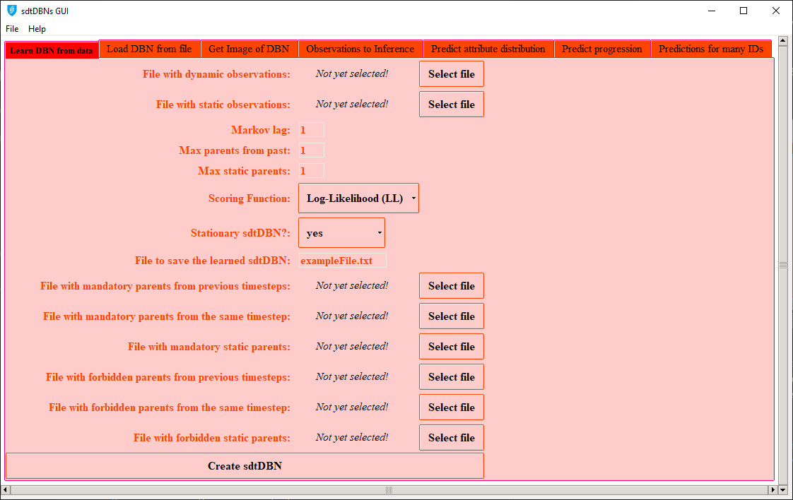
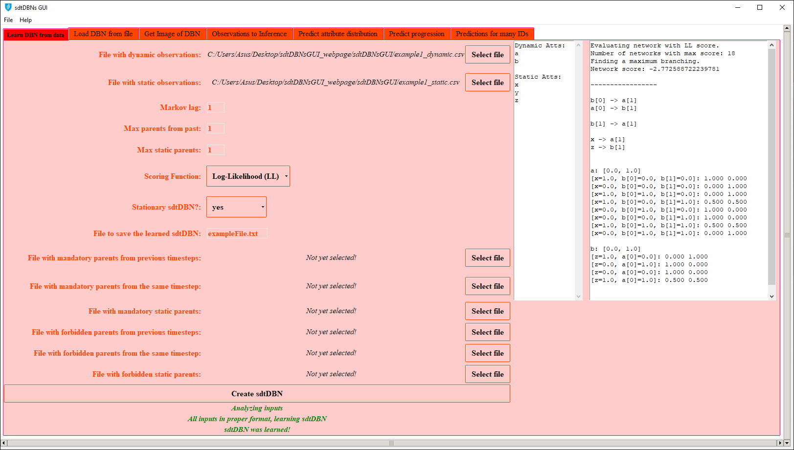
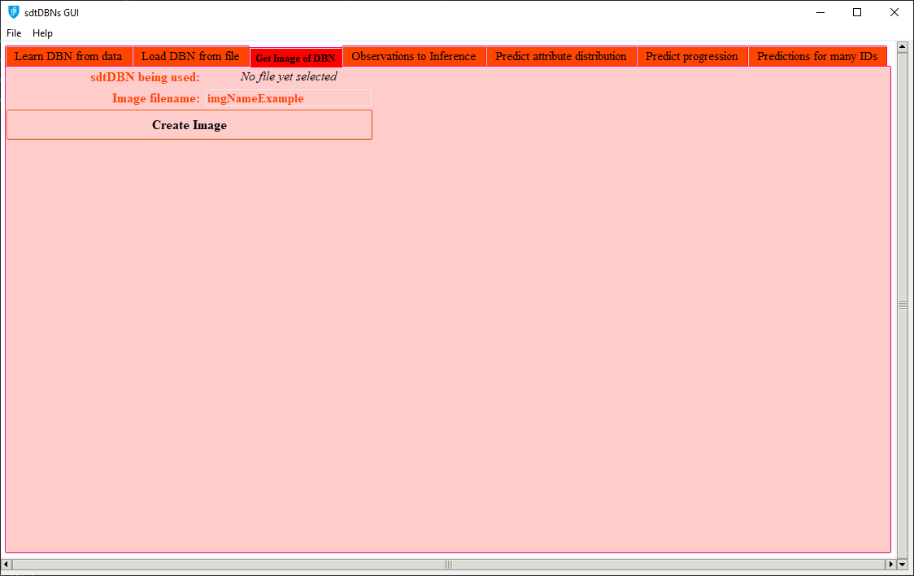
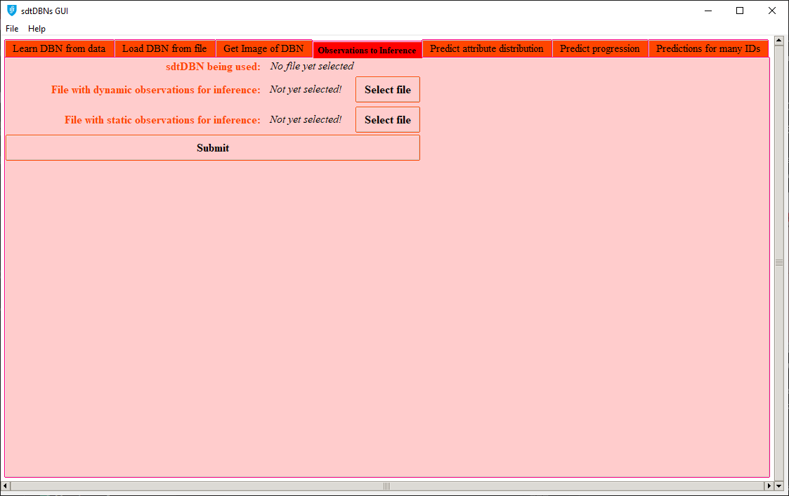

# Website description 

This website contains explains how to use the Graphical User Interface (GUI) of the sdtDBN program.

# sdtDBN program

sdtDBN is a program developed to learn Dynamic Bayesian Networks (DBNs) with both static and dynamic features/attribues, allowing the user to make inference on the learned DBNs. All background related to sdtDBNs can be checked in the sdtDBN website, available at [https://ttlion.github.io/sdtDBN/](https://ttlion.github.io/sdtDBN/). The GUI presented in this website is an interface for a user to be able to use the sdtDBN program capabilities in a graphical way.

# Current releases and libraries

## Current releases

The GUI was developed using Python, being all source files available [here](sources_sdtDBNsGUI.zip), with the respective Github repository available [here](https://github.com/ttlion/sdtDBNsGUI_code).

For a user to be able to run the program without having to resort to the Python programming language, there are available executable standalone versions of the program, for Windows and for Linux, both in version 0.0.1: 

- [Windows executable v.0.0.1](sdtDBN_GUI_windows.zip)
- [Linux executable v.0.0.1](sdtDBN_GUI_Linux.zip)

These executable versions were created, from the Python source code, using [PyInstaller](https://www.pyinstaller.org/).

## External libraries

To generate images for the sdtDBNs, the GUI uses the DOT language. Therefore, if the user wants to use the GUI to create graphical representations of the created sdtDBNs (more details [here](#how-to-use-the-sdtdbn-gui-program)), Graphviz must be installed in the proper Operating System. Check [here](https://www.graphviz.org/download/) for more details on how to install Graphviz.

The program, written in Python, uses several Python libraries/modules (which the user only needs to install if using the source code, instead of the provided executable versions). An overview of the used libraries/modules is given next:

- [tkinter](https://docs.python.org/3/library/tk.html), for generating the Graphical User Interface, with all its capabilities
- [csv](https://docs.python.org/3/library/csv.html), for parsing CSV files
- [sys](https://docs.python.org/3/library/sys.html), for using some specific methods of the Python interpreter
- [os](https://docs.python.org/3/library/os.html), for using some capabilities of the Operating System directly from the Python program
- [subprocess](https://docs.python.org/3/library/subprocess.html), for running command line arguments using the Python program
- [webbrowser](https://docs.python.org/3/library/webbrowser.html), for opening webpages from the GUI
- [re](https://docs.python.org/3/library/re.html), for making operations using regular expressions

# How to use the sdtDBN GUI program?

The sdtDBNs GUI is composed by 7 tabs, each with its specific function in order to use the sdtDBNs capabilities. The general workflow of the sdtDBNs GUI using the developed tabs is the following:

1. To learn an sdtDBN, the user can use either the [first tab][1] or the [second tab][2]. The [first tab][1] should be used if the user wants to learn an sdtDBN from input data/observations, whereas the [second tab][2] should be used if the user wants the retrieve an sdtDBN object previously learned and stored in a file.

2. After learning an sdtDBN, the user might desire to get a graphical representation of the sdtDBN, for which the [third tab][3] should be used.

3. To perform inference, some observations of subjects/ids on which inference is to be made must be given, which can be done in the [fourth tab][4].

4. After learning an sdtDBN and loading the observations for making inference, there are three inference modes a user can choose, each with its specific tab:
   
   1. If the user wants to know the probability distribution of a specific attribute in a specific timestep given the data of a particular subject/id, the [fifth tab][5] should be used.
   
   2. If the user wants to, given the data of a specific subject/id, predict the progression of either all attributes or a particular attribute until a certain timestep, the [sixth tab][6] can be used.
   
   3. If the user wants to make predictions for several subjects/ids, the [seventh tab][7] is the correct one.

Given the general workflow described, the usage of each tab is described next.

## First tab: learning an sdtDBN from user data
[1]: #first-tab-learning-an-sdtdbn-from-user-data

When opening the first tab, the GUI shows the following display:

  
   
    <em>Tab 1 initial display</em>

To learn an sdtDBN using this first tab, the CSV files with observations must be given (if only given dynamic observations, the program will learn a [tDBN](http://josemonteiro.github.io/tDBN/), without static attributes). The CSV input files with dynamic and static observations must be in the format explained in the [sdtDBN webpage](https://ttlion.github.io/sdtDBN/#input-files-formats). The remaining parameters can be tuned according to the user needs. 

For illustration, using, for learning, the same CSV files with observations as in the sdtDBN webpage ([example1_dynamic.csv](example1_dynamic.csv) and [example1_static.csv](example1_static.csv)) and tunning the parameters as in [Example 1 of the sdtDBN webpage](https://ttlion.github.io/sdtDBN/#example-1---learning-a-sdtdbn-with-dynamic-and-static-attributes), the following output is obtained by clicking **create sdtDBN**:

  
   
    <em>Tab 1 after learning an sdtDBN</em>

The object of the learned sdtDBN is stored in a file (named *exampleFile.txt* in the example of the previous image). This file is created in the same directory of the sdtDBN GUI program and can be used to retrieve the learned sdtDBN afterwards, using the [second tab][2].

## Second tab: retrieving an sdtDBN object stored in a file
[2]: #second-tab-retrieving-an-sdtdbn-object-stored-in-a-file

When opening the second tab, the GUI shows the following display:

  
   
    <em>Tab 2 initial display</em>

Following the example presented for the [first tab][1], the object with a learned sdtDBN can be loaded into the GUI program in this second tab. After loading the file (named *exampleFile.txt*) and clicking **submit file**, the following output is obtained:

  
   
    <em>Tab 2 after retrieving an sdtDBN object stored in a file</em>

This output presents the same sdtDBN learned in the [first tab][1].

## Third tab: getting the graphical representation of a learned sdtDBN
[3]: #third-tab-getting-the-graphical-representation-of-a-learned-sdtdbn

When opening the third tab without having learned an sdtDBN either from the [first tab][1] or the [second tab][2], the GUI shows the following display:

  
   
    <em>Tab 3 initial display</em>

   &U27F2 **As the field *dstDBN being used* states by displaying *No file yet selected*, an sdtDBN must be learned ([first][1] or [second][2] tabs) before using this tab.**

After having learned an sdtDBN, a graphical representation can be generated by pressing **Create Image**. 

Providing as the sdtDBN the sdtDBN learned in the [first tab][1], the user would get the following output:

  
   
    <em>Tab 3 after generating image</em>

Besides being presented directly in the GUI (see previous image), the graphical representation of the learned sdtDBN is also stored in a PNG file (named *imgNameExample.png* in the example of the previous image). This file is created in the same directory of the sdtDBN GUI program. As the sdtDBN is the one from the [first tab explanation][1], the graphical representation of the sdtDBN is the same as the one obtained in [Example 1 of the sdtDBN webpage](https://ttlion.github.io/sdtDBN/#example-1---learning-a-sdtdbn-with-dynamic-and-static-attributes).

## Fourth tab: inserting the observation that will be used to make inference on a learned sdtDBN
[4]: #fourth-tab-inserting-the-observation-that-will-be-used-to-make-inference-on-a-learned-sdtdbn

## Fifth tab: predicting the distribution of a selected attribute in a selected timestep for a defined id
[5]: #fifth-tab-predicting-the-distribution-of-a-selected-attribute-in-a-selected-timestep-for-a-defined-id

## Sixth tab: predicting the progression of one or all attributes for a defined id
[6]: #sixth-tab-predicting-the-progression-of-one-or-all-attributes-for-a-defined-id

## Seventh tab: making predictions for several ids
[7]: #seventh-tab-making-predictions-for-several-ids

<!---
# References

Hyperlinks:
[here](https://www.google.pt/)
[https://www.google.pt/](https://www.google.pt/)

Meter algumas referencias bibliograficas?

1. Numbered
2. List

**Bold** and _Italic_ and `Code` text

[Link](url) and 
-->
