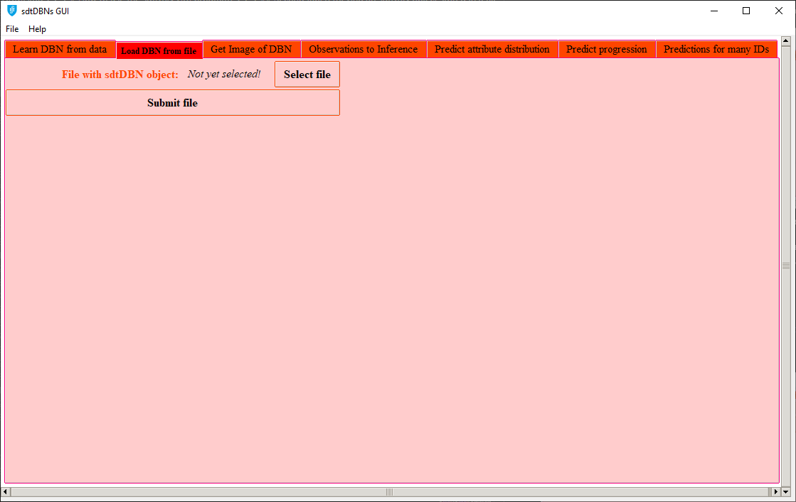
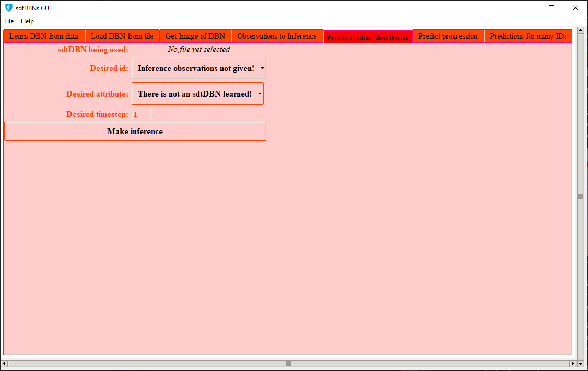
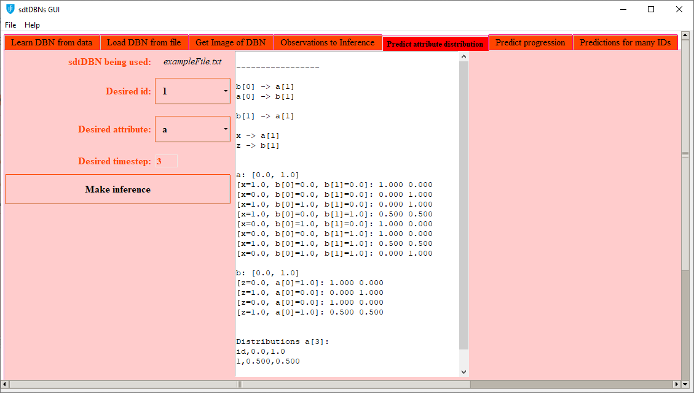
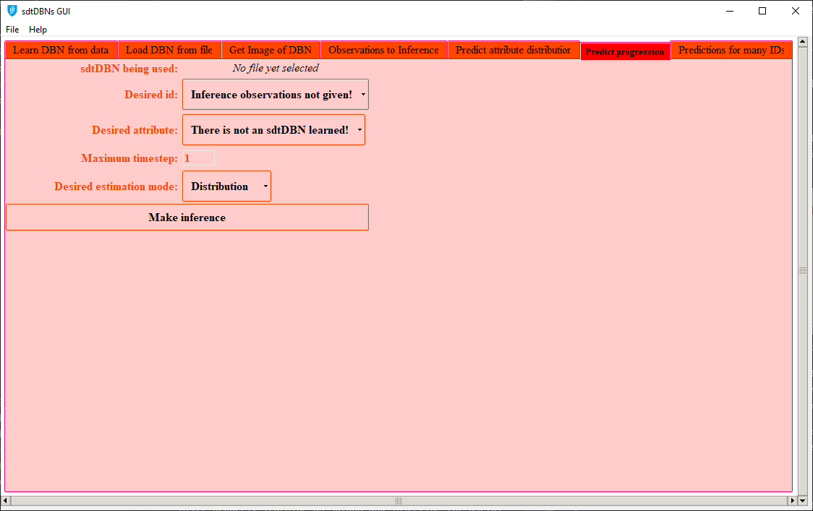
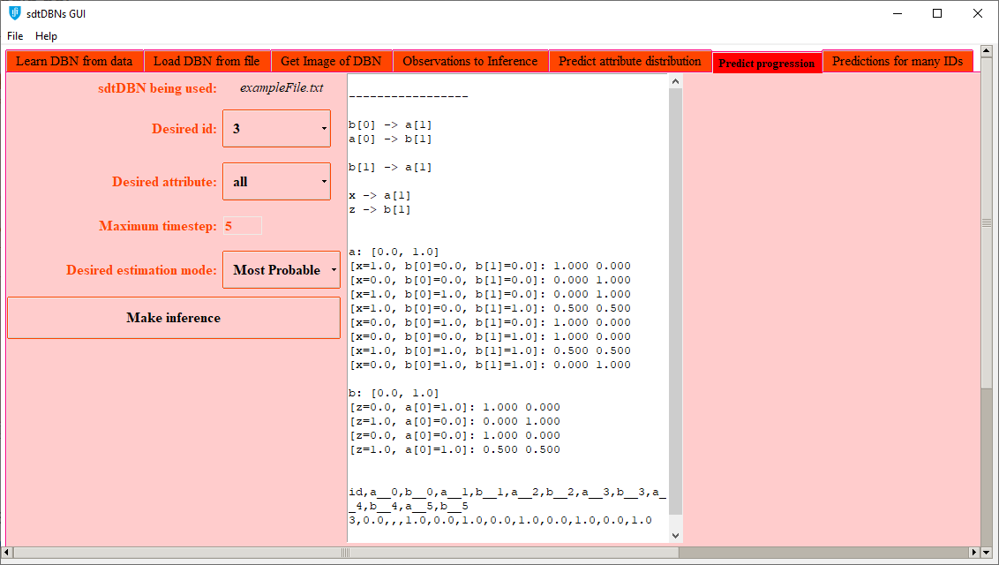
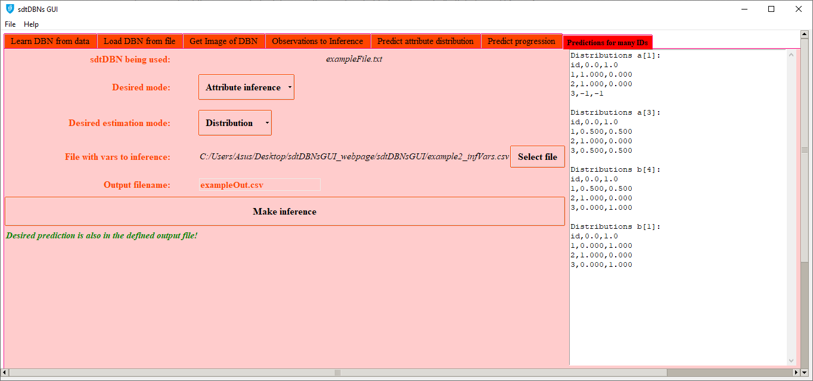
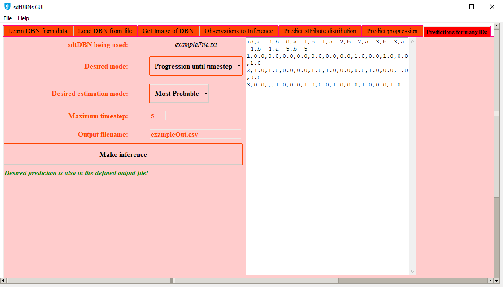

# Website description 

This website explains how to use the Graphical User Interface (GUI) of the sdtDBN program.

# sdtDBN program

sdtDBN is a program developed to learn Dynamic Bayesian Networks (DBNs) with both static and dynamic features/attributes, also allowing a user to make inference on the learned DBNs. All background related to sdtDBNs can be checked in the sdtDBNs' website, available at [https://ttlion.github.io/sdtDBN/](https://ttlion.github.io/sdtDBN/). The GUI presented in this website is an interface for a user to be able to control the sdtDBN program's capabilities in a graphical way.

# Current releases and external libraries

## Current releases

The GUI was developed using Python, being all source files available [here](sources_sdtDBNsGUI.zip), with the respective GitHub repository available [here](https://github.com/ttlion/sdtDBNsGUI_code).

For a user to be able to run the program without having to resort to the Python programming language, there are available executable standalone versions of the program, for Windows and for Linux, both in version 0.0.1: 

- [Windows executable v.0.0.1](sdtDBN_GUI_Windows.zip)
- [Linux executable v.0.0.1](sdtDBN_GUI_Linux.zip)

These executable versions were created, from the Python source code, using [PyInstaller](https://www.pyinstaller.org/).

## External libraries

To generate images for the sdtDBNs, the GUI uses the DOT language. Therefore, if the user wants to employ the GUI to create graphical representations of the learned sdtDBNs (more details [here](#how-to-use-the-sdtdbn-gui-program)), [Graphviz](https://www.graphviz.org/) must be installed in the proper Operating System. Check [here](https://www.graphviz.org/download/) for more details on how to install [Graphviz](https://www.graphviz.org/).

The program, written in Python, uses several Python libraries/modules (which the user only needs to install if working with the source code, instead of the provided executable versions). An overview of the used libraries/modules is given next:

- [tkinter](https://docs.python.org/3/library/tk.html), for generating the Graphical User Interface, with all its capabilities
- [csv](https://docs.python.org/3/library/csv.html), for parsing CSV files
- [sys](https://docs.python.org/3/library/sys.html), for using some specific methods of the Python interpreter
- [os](https://docs.python.org/3/library/os.html), for using some capabilities of the Operating System directly from the Python program
- [subprocess](https://docs.python.org/3/library/subprocess.html), for running command line arguments using the Python program
- [webbrowser](https://docs.python.org/3/library/webbrowser.html), for opening webpages from the GUI
- [re](https://docs.python.org/3/library/re.html), for making operations using regular expressions

# How to use the sdtDBN GUI program?

The sdtDBNs GUI is composed by 7 tabs, each with its specific function in order to use the sdtDBNs capabilities. The general workflow of the sdtDBNs GUI using the developed tabs is the following:

1. To learn an sdtDBN, the user can resort to either the [first tab][1] or the [second tab][2]. The [first tab][1] should be used if the user wants to learn an sdtDBN from input data/observations, whereas the [second tab][2] should be used if the user wants to retrieve an sdtDBN object previously learned and stored in a file.

2. After learning an sdtDBN, the user might desire to get a graphical representation of the sdtDBN, for which the [third tab][3] should be used.

3. To perform inference, there must be given some observations of subjects/ids on which inference is to be made, which can be done in the [fourth tab][4].

4. After learning an sdtDBN and loading the observations for making inference, there are three inference modes a user can choose, each in its specific tab:
   
   1. If the user wants to know the probability distribution of a specific attribute in a particular timestep given the data of a certain subject/id, the [fifth tab][5] should be used.
   
   2. If the user wants to, given the data of a specific subject/id, predict the progression of either all attributes or a particular attribute until a certain timestep, the [sixth tab][6] can be used.
   
   3. If the user wants to make predictions for several subjects/ids, the [seventh tab][7] is the correct one.

Given the general workflow described, the usage of each tab is described next. Throughout the explanations, several input files are used, which can be downloaded by clicking on their names or at the side of the webpage, where there is provided a zip file with all input files used.

## First tab: learning an sdtDBN from user data
[1]: #first-tab-learning-an-sdtdbn-from-user-data

When opening the first tab, the GUI shows the following display:

  
   
    <em>Tab 1 initial display</em>

To learn an sdtDBN using this first tab, the CSV files with observations must be given (if only given dynamic observations, the program will learn a [tDBN](http://josemonteiro.github.io/tDBN/), without static attributes). The CSV input files with dynamic and static observations must be in the format explained in the [proper section of the sdtDBN webpage](https://ttlion.github.io/sdtDBN/#input-files-formats). The remaining parameters can be tuned according to the user's needs. 

For illustration, providing the following parameters:

- **File with dynamic observations:** [example1_dynamic.csv](example1_dynamic.csv)
- **File with static observations:** [example1_static.csv](example1_static.csv)
- **Markov lag:** 1
- **Max parents from past:** 1
- **Max static parents:** 1
- **Scoring Function:** Log-Likelihood (LL)
- **Stationary sdtDBN?:** yes
- **File to save the learned sdtDBN:** exampleFile.txt

The output would be:

  
   
    <em>Tab 1 after learning an sdtDBN</em>

The obtained sdtDBN shown in the previous image is the same one as in [Example 1 of the sdtDBN webpage](https://ttlion.github.io/sdtDBN/#example-1---learning-a-sdtdbn-with-dynamic-and-static-attributes), as all the parameters are the same.

The object with the learned sdtDBN is stored in a file (named exampleFile.txt in the example of the previous image). This file is created in the same directory of the sdtDBN GUI program and can be used to retrieve the learned sdtDBN afterwards, using the [second tab][2].

## Second tab: retrieving an sdtDBN object stored in a file
[2]: #second-tab-retrieving-an-sdtdbn-object-stored-in-a-file

When opening the second tab, the GUI shows the following display:

  
   
    <em>Tab 2 initial display</em>

Having an sdtDBN object stored in a file (after, for example, learning an sdtDBN from data using the [first tab][1]), the object with the learned sdtDBN can be loaded into the GUI program using this second tab.

Therefore, providing the following parameter:

- **File with sdtDBN object:** exampleFile.txt (see [first tab][1])

The output would be:

  
   
    <em>Tab 2 after retrieving an sdtDBN object stored in a file</em>

This output presents the same sdtDBN learned in the [first tab][1].

## Third tab: getting the graphical representation of a learned sdtDBN
[3]: #third-tab-getting-the-graphical-representation-of-a-learned-sdtdbn

When opening the third tab without having learned an sdtDBN either from the [first tab][1] or the [second tab][2], the GUI shows the following display:

  
   
    <em>Tab 3 initial display</em>

&emsp;:warning::warning::warning: *As the field **sdtDBN being used** states by displaying **No file yet selected**, an sdtDBN must be learned (using the [first][1] or [second][2] tabs) before using this tab.* :warning::warning::warning:

After having learned an sdtDBN, a graphical representation can be generated in this third tab.

Therefore, using the following parameters:
- **sdtDBN being used:** exampleFile.txt (inserted in [first tab][1])
- **Image filename:** imgNameExample
  
The output would be:

  
   
    <em>Tab 3 after generating image</em>

Besides being presented directly in the GUI (see previous image), the graphical representation of the learned sdtDBN is also stored in a PNG file (named imgNameExample.png in the example of the previous image). This file is created in the same directory of the sdtDBN GUI program. As the sdtDBN is the one from the [first tab explanation][1], the graphical representation of the sdtDBN is the same as the one obtained in [Example 1 of the sdtDBN webpage](https://ttlion.github.io/sdtDBN/#example-1---learning-a-sdtdbn-with-dynamic-and-static-attributes).

## Fourth tab: inserting the observations that will be used to make inference on a learned sdtDBN
[4]: #fourth-tab-inserting-the-observations-that-will-be-used-to-make-inference-on-a-learned-sdtdbn

When opening the fourth tab without having learned an sdtDBN either from the [first tab][1] or the [second tab][2], the GUI shows the following display:

  
   
    <em>Tab 4 initial display</em>

&emsp;:warning::warning::warning: *As the field **sdtDBN being used** states by displaying **No file yet selected**, an sdtDBN must be learned (using the [first][1] or [second][2] tabs) before using this tab.* :warning::warning::warning:

After learning an sdtDBN, the user must come to this tab to introduce the observations that should be used when making inference.

For example, inserting the following parameters:
- **sdtDBN being used:** exampleFile.txt (inserted in [first tab][1])
- **File with dynamic observations for inference:** [example2_dynamic_inf.csv](example2_dynamic_inf.csv)
- **File with static observations for inference:** [example2_static_inf.csv](example2_static_inf.csv)

The output would be:

  
   
    <em>Tab 4 after submitting the CSV files with the useful observations for making inference</em>

In the example provided in the previous image, the introduced files were the ones used in the [sdtDBN webpage](https://ttlion.github.io/sdtDBN/), so that the explanations of the remaining tabs can relate to the examples presented in the [sdtDBN webpage](https://ttlion.github.io/sdtDBN/).

As stated in the explanation of the [first tab][1], the CSV input files with dynamic and static observations must be in the [format explained in the sdtDBN webpage](https://ttlion.github.io/sdtDBN/#input-files-formats).

## Fifth tab: predicting the distribution of a selected attribute in a certain timestep for a defined id
[5]: #fifth-tab-predicting-the-distribution-of-a-selected-attribute-in-a-certain-timestep-for-a-defined-id

When opening the fifth tab without having learned an sdtDBN (either from the [first tab][1] or the [second tab][2]), and without having specified any observations to be used for inference (using the [fourth tab][4]) the GUI shows the following display:

  
   
    <em>Tab 5 initial display</em>

&emsp;:warning::warning::warning: *As the field **sdtDBN being used** states by displaying **No file yet selected**, an sdtDBN must be learned (using the [first][1] or [second][2] tabs) before using this tab.* :warning::warning::warning:

&emsp;:warning::warning::warning: *As the field **Desired id** states by displaying **Inference observations not given!**, the observations to be used when making inference should be inserted (using the [fourth tab][4]) before using this tab.* :warning::warning::warning:

After properly learning an sdtDBN and inserting the useful observations for inference, a user can select the several options of this tab to determine the probability distribution of an attribute in a certain timestep for a selected id.

For example, introducing the following arguments:
- **sdtDBN being used:** exampleFile.txt (inserted in [first tab][1])
- **Desired id:** 1
- **Desired attribute:** a
- **Desired timestep:** 3

And having inserted the observations for inference detailed in the explanation of the [fourth tab][4], the output would be:

  
   
    <em>Tab 5 after specifying all parameters needed</em>

This output is the same as the one obtained when the distributions are determined in [Example 2 of the sdtDBN webpage](https://ttlion.github.io/sdtDBN/#example-2---inference-of-specific-attributes-on-a-learned-sdtdbn-with-dynamic-and-static-attributes).

## Sixth tab: predicting the progression of one or all attributes, for a defined id
[6]: #sixth-tab-predicting-the-progression-of-one-or-all-attributes-for-a-defined-id

When opening the sixth tab without having learned an sdtDBN (either from the [first tab][1] or the [second tab][2]), and without having specified any observations to be used for inference (using the [fourth tab][4]) the GUI shows the following display:

  
   
    <em>Tab 6 initial display</em>

&emsp;:warning::warning::warning: *As the field **sdtDBN being used** states by displaying **No file yet selected**, an sdtDBN must be learned (using the [first][1] or [second][2] tabs) before using this tab.* :warning::warning::warning:

&emsp;:warning::warning::warning: *As the field **Desired id** states by displaying **Inference observations not given!**, the observations to be used when making inference should be inserted (using the [fourth tab][4]) before using this tab.* :warning::warning::warning:

After properly learning an sdtDBN and inserting the useful observations for inference, the several options of this tab allow a user to determine a trajectory, until a certain timestep, of either a specific attribute or all attributes, given the data of a defined subject/id.

For example, introducing the following arguments:
- **sdtDBN being used:** exampleFile.txt (inserted in [first tab][1])
- **Desired id:** 3
- **Desired attribute:** all
- **Maximum timestep:** 5
- **Desired estimation mode:** Most Probable

And having inserted the observations for inference detailed in the explanation of the [fourth tab][4], the output would be:

  
   
    <em>Tab 6 after specifying all parameters needed</em>

The trajectory obtained in the previous image is the same as the one obtained in [Example 3 of the sdtDBN webpage](https://ttlion.github.io/sdtDBN/#example-3---getting-an-estimated-trajectory) for subject 3, as all parameters specified are the same.

## Seventh tab: making predictions for several ids
[7]: #seventh-tab-making-predictions-for-several-ids

When opening the seventh tab without having learned an sdtDBN (either from the [first tab][1] or the [second tab][2]), and without having specified any observations to be used for inference (using the [fourth tab][4]) the GUI shows one of the two displays presented next, according to the selected mode of this seventh tab.

In the **Attribute inference** mode, the initial display would be the following:

  
   
    <em>Initial display of tab 7 in <b>Attribute inference</b> mode</em>

In the **Progression until timestep** mode, the initial display would be the following:

  
   
    <em>Initial display of tab 7 in <b>Progression until timestep</b> mode</em>

&emsp;:warning::warning::warning: *As the field **sdtDBN being used** states by displaying **No file yet selected**, an sdtDBN must be learned (using the [first][1] or [second][2] tabs) before using this tab.* :warning::warning::warning:

&emsp;:warning::warning::warning: *As this tab concerns inference capabilities of the sdtDBN, the observations to be used when making inference should be inserted (using the [fourth tab][4]) before using this tab.* :warning::warning::warning:

As already stated, this seventh tab has two modes: **Attribute inference** and **Progression until timestep**. Each mode functioning is detailed next.

### Seventh tab — Attribute inference mode

In the **Attribute inference** mode (see the [first image of this tab's explanation](#img_tab7_attInf)), besides choosing among the available estimation modes (see [Example 2 of the sdtDBN webpage](https://ttlion.github.io/sdtDBN/#example-2---inference-of-specific-attributes-on-a-learned-sdtdbn-with-dynamic-and-static-attributes) for details on the three available modes), the user must introduce a file with the variables in which inference is to be made. This file must be a CSV file in the format described at the [proper section of the sdtDBN webpage](https://ttlion.github.io/sdtDBN/#file-with-variables-and-respective-timesteps-to-make-inference). The program will provide, for all subjects/ids in the observation files given in the [fourth tab][4], estimations for the attributes selected in the previously mentioned CSV file with the variables in which inference is to be made.

For illustration, introducing the following arguments:
- **sdtDBN being used:** exampleFile.txt (inserted in [first tab][1])
- **Desired mode:** Attribute inference
- **Desired estimation mode:** Distribution
- **File with vars to inference:** [example2_infVars.csv](example2_infVars.csv) (same file used in the [sdtDBN webpage](https://ttlion.github.io/sdtDBN/))
- **Output filename:** exampleOut.csv

And having inserted the observations for inference detailed in the explanation of the [fourth tab][4], the output would be:

  
   
    <em>Display of tab 7 in <b>Attribute inference</b> mode, after making inference</em>

The inference output presented in the previous image is the same output obtained when the distributions are determined in [Example 2 of the sdtDBN webpage](https://ttlion.github.io/sdtDBN/#example-2---inference-of-specific-attributes-on-a-learned-sdtdbn-with-dynamic-and-static-attributes).

When making inference as shown in the previous image, the inference output is also saved in a file with the name provided by the user in the GUI (exampleOut.csv in the example of the previous image). This file is created in the same directory of the sdtDBN GUI program.

### Seventh tab — Progression until timestep mode

In the **Progression until timestep** mode (see the [second image of this tab's explanation](#img_tab7_prog)), the user should define the desired estimation mode and the maximum timestep. The program will determine, for all subjects/ids in the observation files given in the [fourth tab][4], an estimated trajectory of all attributes until the defined maximum timestep.

For instance, introducing the following arguments:
- **sdtDBN being used:** exampleFile.txt (inserted in [first tab][1])
- **Desired mode:** Progression until timestep
- **Desired estimation mode:** Most Probable
- **Maximum timestep:** 5
- **Output filename:** exampleOut.csv

And having inserted the observations for inference detailed in the explanation of the [fourth tab][4], the output would be:

  
   
    <em>Display of tab 7 in <b>Progression until timestep</b> mode, after making inference</em>

The inference output presented in the previous image is the same output given in [Example 3 of the sdtDBN webpage](https://ttlion.github.io/sdtDBN/#example-3---getting-an-estimated-trajectory).

The inference output of the example of the previous image is also saved in a file with the name provided by the user in the GUI (exampleOut.csv in the example of the previous image). This file is created in the same directory of the sdtDBN GUI program.

<!---
# References

Hyperlinks:
[here](https://www.google.pt/)
[https://www.google.pt/](https://www.google.pt/)

Meter algumas referencias bibliograficas?

1. Numbered
2. List

**Bold** and _Italic_ and `Code` text

[Link](url) and 
-->
